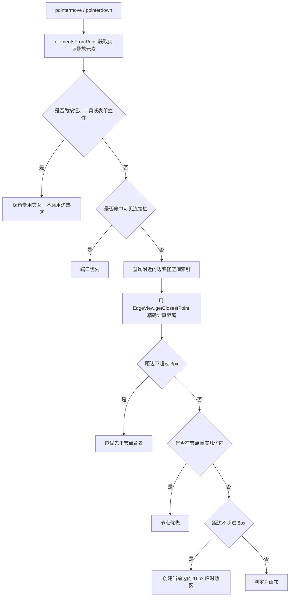

# FlowGraph 节点与边点击命中优化说明

## 1. 文档目标

本文说明 FlowGraph 中节点、连接桩和边的 hover、光标与点击命中优化，重点解释以下问题：

- 为什么 X6 原生的 `node:mouseenter` / `node:mouseleave` 在密集区域看起来不精确。
- 为什么只修改边的 `.connection-wrap` 宽度仍然会出现“点不中”或“点错边”。
- `pointerHitCoordinator.ts` 如何统一判断端口、节点、边和画布。
- 为什么边需要路径空间索引，以及如何避免在 500 节点、800 条边的图上每帧遍历全部边。
- 为什么必须在 `pointerdown` 时同步复核命中结果。

核心实现位于：

- `packages/webview/src/components/graph/flowGraph/pointerHitCoordinator.ts`
- `packages/webview/src/components/graph/flowGraph/graphEventRegistry.ts`
- `packages/webview/src/components/graph/flowGraph/useFlowGraphInstance.ts`
- `packages/webview/src/components/graph/edgeConnection.ts`
- `packages/webview/src/components/graph/FlowGraph.css`

## 2. 原始问题

### 2.1 节点的 DOM 范围不等于可见几何

X6 ReactShape 通常通过 `foreignObject` 承载 React 节点。即使用户看到的是圆形、菱形或五边形，DOM 仍可能占据完整矩形。

因此，如果完全依赖浏览器 DOM 命中：

- Start/Then 圆形节点的矩形四角也会被认为在节点内。
- Condition 菱形节点的透明四角会阻挡其下方的边。
- Goto 五边形斜边外侧也可能保持节点 hover 状态。

另外，节点连接热区属于 NodeView DOM。热区覆盖节点边界后，鼠标从节点移向附近的边时，浏览器仍可能认为指针没有离开原 NodeView，导致 `node:mouseleave` 延迟。

### 2.2 边的可见线太细，原生透明命中范围又容易重叠

边的可见线通常只有 1～2px。X6 通过透明的 `.connection-wrap` 扩大点击范围，默认宽度约为 15px。

如果永久保留较宽的 `.connection-wrap`：

- 平行边或交叉边容易出现透明范围重叠。
- 浏览器按 DOM 层级选择最上方的边，不一定是离指针最近的边。
- 节点附近，NodeView 可能遮挡边的透明路径。

当前公共 CSS 将所有普通边的永久透明范围收紧为 8px：

```css
.flow-graph-container .x6-edge .connection-wrap {
  stroke-width: 8px;
}
```

这降低了密集边之间的重叠，但仅靠 8px 原生范围会增加“点不中”的概率。因此实现采用了“两级范围”：

- 所有边永久保留 8px 的原生 `.connection-wrap`。
- 逻辑命中某条边后，只为该边创建总宽 16px 的临时悬浮热区。

### 2.3 `pointermove` 与点击之间存在时序差

旧实现只在 `pointermove` 中通过 `requestAnimationFrame` 更新悬浮热区。快速从边 A 移到边 B 后立即按下时，可能发生以下顺序：

1. 浏览器产生边 B 上的 `pointermove`。
2. 协调器安排下一帧重新计算，但尚未执行。
3. 用户立即按下鼠标。
4. DOM 中仍然存在绑定到边 A 的热区。
5. X6 在 `mousedown` 时把本次交互锁定到边 A 的 EdgeView。

X6 Selection 插件在 `cell:mouseup` 时完成选择，但它使用的是 `mousedown` 阶段确定的 CellView，所以单纯在 `mouseup` 时修正已经太晚。

## 3. 总体设计

命中协调器不伪造 X6 事件，也不修改 DSL/RBG 数据，而是在浏览器把事件交给 X6 之前，使正确 CellView 的 DOM 热区位于指针下方。



最终优先级为：

1. 专用交互控件。
2. 可见连接桩。
3. 距真实边路径不超过 3 屏幕像素的边。
4. 节点真实可见几何。
5. 距真实边路径不超过 8 屏幕像素的扩展边热区。
6. 画布。

这意味着边穿过节点时，直接点击可见线仍能选择边；距离边较远、但仍位于节点内部时，则选择节点。

## 4. 节点真实几何判断

`containsNodePoint()` 先取得节点模型坐标的包围盒，再把指针换算成 0～1 的局部坐标：

```ts
const bbox = node.getBBox()
if (!bbox.containsPoint({ x, y }) || bbox.width === 0 || bbox.height === 0) {
  return false
}

const localX = (x - bbox.x) / bbox.width
const localY = (y - bbox.y) / bbox.height
```

不同形状使用不同公式。

### 4.1 Start/Then：椭圆

```ts
const dx = localX - 0.5
const dy = localY - 0.5
return dx * dx + dy * dy <= 0.25
```

将节点归一化后，中心为 `(0.5, 0.5)`，半径为 `0.5`。矩形四角不再被误认为节点。

### 4.2 Condition：菱形

```ts
return Math.abs(localX - 0.5) + Math.abs(localY - 0.5) <= 0.5
```

这是标准菱形的曼哈顿距离判断，透明四角会被排除。

### 4.3 Goto：五边形

Goto 使用五个归一化顶点，再通过射线法 `isPointInPolygon()` 判断：

```ts
return isPointInPolygon(localX, localY, [
  [0, 0],
  [0.75, 0],
  [1, 0.5],
  [0.75, 1],
  [0, 1],
])
```

其他普通矩形节点在通过 `bbox.containsPoint()` 后直接认为命中。

## 5. 边路径空间索引

### 5.1 为什么不能只使用 `elementsFromPoint()`

`document.elementsFromPoint()` 适合获取当前点真实叠放的 DOM 元素，但不能作为全部边候选来源：

- 被 NodeView 遮挡的边不会出现。
- 指针位于原生 8px `.connection-wrap` 之外时，边不会出现。
- 旧边热区可能成为最上层元素，对结果产生粘滞偏置。

所以实现中，`elementsFromPoint()` 只负责：

- 发现端口和节点 DOM。
- 保留按钮、输入框、折点、箭头、Transform 等专用交互。
- 提供多条等距边的 DOM 层级信息。

附近边候选由路径空间索引提供。

### 5.2 96 单位网格

```ts
const EDGE_INDEX_GRID_SIZE = 96
const edgeBuckets = new Map<string, Map<string, EdgeView>>()
```

每个网格桶保存经过该区域的 EdgeView。查询指针附近时，仅访问命中容差矩形覆盖的桶。

例如 1× 缩放下，扩展半径是 8 个图坐标单位，通常只需读取一个或相邻少量网格，而不需要遍历 800 条边。

### 5.3 使用 X6 已计算的实际连接路径

边可能使用 Manhattan router、rounded connector 或曲线路径，不能只用 source、target、vertices 拼接直线。

索引直接读取 EdgeView 当前连接路径：

```ts
const connection = view.getConnection()
const polylines = connection.toPoints({
  segmentSubdivisions: view.getConnectionSubdivisions(),
})
```

`getConnectionSubdivisions()` 是 X6 为曲线计算并缓存的细分结果。通过这些细分点建立索引，可以覆盖圆角和曲线路由。

索引只负责找到“可能在附近”的边，最终距离仍使用 X6 的实际路径：

```ts
const closestPoint = view.getClosestPoint(localPoint)
const distance = closestPoint?.distance(localPoint)
```

因此，折线细分误差不会直接决定最终选中结果。

### 5.4 哪些边不会进入索引

```ts
const isIndexableEdge = (edge: Edge) => (
  edge.isVisible()
  && !isPreConnectionPreview(edge)
  && !isSequenceConnectionPreview(edge)
)
```

过滤以下内容：

- 隐藏边。
- 节点拖动时产生的预连线边。
- 时序图临时连接预览边。

这与现有序列化过滤规则保持一致，避免用户选中尚未成为业务数据的临时边。

### 5.5 增量失效与重建

以下变化会使某条边的路径发生改变：

- 边新增、删除。
- source、target、vertices 变化。
- router、connector、visible 变化。
- 关联节点的位置、尺寸、角度或端口变化。

处理方式不是立即在每个事件中重建全部索引，而是标记相关 Edge ID：

```ts
const markEdgeDirty = (edge: Edge) => {
  dirtyEdgeIds.add(edge.id)
  renderPendingEdgeIds.add(edge.id)
  scheduleEdgeIndexUpdate()
}
```

普通变化通过 `requestAnimationFrame` 合并；命中查询发生在刷新帧之前时，会同步刷新这些脏边，保证点击不使用旧路径。

X6 异步视图在 `render:done` 后再校准一次：

```ts
const handleRenderDone = () => {
  if (!edgeIndexInitialized) {
    buildEdgeIndex()
    return
  }

  renderPendingEdgeIds.forEach(edgeId => dirtyEdgeIds.add(edgeId))
  renderPendingEdgeIds.clear()
  if (dirtyEdgeIds.size > 0) flushDirtyEdgeIndex()
}
```

这用于处理模型先变化、EdgeView 路径后更新的异步时序。

## 6. 多条边的选择规则

附近候选边首先按真实路径距离排序。如果距离相同，再依次比较：

1. 更高的 `zIndex`。
2. `elementsFromPoint()` 中更靠前的 DOM 层级。
3. EdgeView 容器的实际 DOM 顺序。
4. 稳定的 Edge ID。

对应代码：

```ts
const compareEdgeCandidates = (left, right) => (
  left.distance - right.distance
  || right.zIndex - left.zIndex
  || left.domRank - right.domRank
  || compareDomOrder(left.view, right.view)
  || left.view.cell.id.localeCompare(right.view.cell.id)
)
```

活动边不会得到额外优先权；旧热区元素也会从 DOM 候选中排除：

```ts
if (isEdgeHotAreaElement(element)) return
```

这解决了从边 A 移向边 B 时仍然粘在 A 上的问题。完全重合的边则通过 z-index、DOM 和 ID 得到稳定结果，避免同一位置反复跳动。

## 7. 屏幕像素与缩放

产品交互约定使用屏幕像素：

```ts
const EDGE_VISIBLE_TOLERANCE_PX = 3
const EDGE_HIT_TOLERANCE_PX = 8
const EDGE_HOT_AREA_WIDTH = 16
```

距离计算发生在图坐标中，所以需要除以当前缩放比例：

```ts
const zoom = Math.max(graph.zoom(), 0.01)
const visibleTolerance = EDGE_VISIBLE_TOLERANCE_PX / zoom
const hitTolerance = EDGE_HIT_TOLERANCE_PX / zoom
```

悬浮 SVG 路径使用：

```ts
edgeHotArea.setAttribute('vector-effect', 'non-scaling-stroke')
```

因此无论 0.5×、1× 还是 2× 缩放，用户看到的点击范围都是中心线两侧各约 8px，而不会随画布缩放变得过宽或过窄。

## 8. 点击前同步复核

### 8.1 Hover 仍然按帧合并

```ts
const handlePointerMove = (event: PointerEvent) => {
  pendingPoint = { clientX: event.clientX, clientY: event.clientY }
  if (frameId === null) frameId = requestAnimationFrame(update)
}
```

一帧内多次 `pointermove` 只会执行一次命中计算，避免高频事件放大。

### 8.2 `pointerdown` 必须同步执行

```ts
const handlePointerDown = (event: PointerEvent) => {
  if (frameId !== null) cancelAnimationFrame(frameId)
  pendingPoint = null

  const hit = resolveAtPoint(event.clientX, event.clientY, { lock: true })
  interactionLocked = true
  lockedEdgeView = hit.type === 'edge' ? hit.view : null
  setActiveHotAreaEdge(lockedEdgeView)
}
```

该监听器注册在 Graph 容器的捕获阶段，所以先于 X6 的委托式 `mousedown` 处理：

```ts
container.addEventListener('pointerdown', handlePointerDown, true)
```

同步复核会：

- 取消尚未执行的 hover 帧。
- 忽略旧热区重新解析当前位置。
- 在 X6 查找事件目标前，把热区绑定到正确 EdgeView。
- 如果实际目标是端口、节点或专用工具，则立即删除边热区。

### 8.3 从按下到抬起锁定 EdgeView

按下边后，临时热区保持绑定同一 EdgeView，直到 `pointerup`。这样 X6 的以下原生行为使用同一目标：

- `edge:mousedown`
- 边拖动
- `cell:mouseup`
- Selection 插件选择
- `edge:click`
- 属性面板显示

释放后在下一帧重新计算 hover，避免在 X6 的 `mouseup` / `click` 事件链完成前过早移除目标 DOM。

## 9. 临时 Edge Hot Area

临时热区是一条透明 SVG path，只存在一条：

```ts
edgeHotArea = document.createElementNS(SVG_NAMESPACE, 'path')
edgeHotArea.classList.add(
  'x6-cell',
  'x6-edge',
  'flow-graph-edge-hot-area',
)
edgeHotArea.setAttribute('pointer-events', 'stroke')
edgeHotArea.setAttribute('stroke-width', '16')
```

它使用原边的路径和 ID：

```ts
edgeHotArea.setAttribute('data-cell-id', view.cell.id)
edgeHotArea.setAttribute('data-shape', view.cell.shape)
edgeHotArea.setAttribute('d', view.getConnectionPathData())
```

X6 GraphView 会通过 `data-cell-id` 找到原始 EdgeView，因此不需要手动触发或伪造 `edge:click`。点击、双击、右键和拖动仍由 X6 原生事件系统完成。

与给所有边永久设置 16px `.connection-wrap` 相比，单活动热区的优势是：

- 密集区域不会同时叠放大量宽透明路径。
- 目标由最近路径算法决定，而不是由浏览器碰巧命中的 DOM 决定。
- 鼠标离开、目标变化、边删除或 Graph 销毁时可以立即移除。

## 10. 节点连接热区

节点的普通连接热区厚度为 6px：

```ts
const HOT_EDGE_THICKNESS = 6
```

热区以节点边界为中心，内外各约 3px。显示和隐藏由逻辑命中结果控制，不再依赖原生 `node:mouseenter` / `node:mouseleave`：

```ts
setActiveHotAreaNode(
  hit.type === 'node' || hit.type === 'port' ? hit.node : null,
)
```

hover 只修改 NodeView DOM 的显示状态，不调用 `setPortProp()`，所以不会：

- 重建节点端口 DOM。
- 触发边终端 magnet 重新查找。
- 触发图序列化和 `onChange`。
- 引起 ReactShape 重渲染。

时序图继续使用生命线连接逻辑，不启用普通四边热区。

## 11. 专用交互保护

以下元素保留自己的 cursor 和事件处理，不参与普通边、节点竞争：

```ts
const SPECIAL_INTERACTION_SELECTOR = [
  'button',
  'input',
  'textarea',
  'select',
  'a',
  '[contenteditable="true"]',
  '[data-sequence-lifeline-magnet]',
  '.x6-cell-tools',
  '.x6-edge-tool',
  '.x6-widget-transform',
  '.x6-widget-selection-box',
].join(',')
```

只检查 `elementsFromPoint()` 中除临时边热区以外的最上层真实元素，避免底层某个不可见工具错误阻断当前命中。

## 12. 生命周期与清理

`graphEventRegistry.ts` 在创建公共 Graph 事件时注册协调器：

```ts
const disposePointerHitCoordinator = registerPointerHitCoordinator(
  graph,
  options.strategy,
  options.readOnly,
)
```

`useFlowGraphInstance.ts` 在 Graph 销毁前执行 disposer：

```ts
disposeGraphEventHandlers()
changeScheduler.flush()
changeScheduler.dispose()
graph.dispose()
```

disposer 会清理：

- 容器上的 `pointermove`、`pointerdown` 和 `pointerleave`。
- document 上的 `pointerup` 和 `pointercancel`。
- 所有边、节点和 `render:done` 监听器。
- 待执行的 requestAnimationFrame。
- 当前节点/边热区和临时 cursor。
- 空间索引、脏 Edge ID 和渲染等待集合。

这避免重复 `loadData()` 或反复进入画布时积累监听器和 SVG 热区。

## 13. 性能特征

### Pointer move

- 每个动画帧最多解析一次。
- 使用 `elementsFromPoint()` 获取当前叠放 DOM，不调用会遍历全部 Cell 的 `findViewsFromPoint()`。
- 边候选只查询指针附近的 96 单位网格。
- 只对附近候选调用 `getClosestPoint()`。

### 图变化

- 节点移动只标记其关联边。
- 多次模型变化在同一动画帧内合并。
- EdgeView 异步渲染完成后只重新校准待处理边。
- 首次索引通常在 `render:done` 构建；如果用户更早直接点击，则同步冷启动一次，保证正确性。

## 14. 建议验收场景

### 基础点击

1. 在边中心线上直接点击，不预先移动鼠标，确认边被选择且属性面板显示该边。
2. 分别在距离边约 3px、6px、8px、10px 的位置点击：
   - 0～8px 应能命中。
   - 超过 8px 应进入节点或画布逻辑。
3. 快速从边 A 移到边 B 并立即点击，确认不会仍选择边 A。

### 密集区域

1. 创建间距为 4px、8px、12px 的平行边。
2. 在两条边之间缓慢和快速移动，确认始终选择距离最近的边。
3. 创建交叉边，分别点击交点两侧，确认目标稳定。
4. 完全重合的边重复点击，确认不会随机跳动。

### 节点与边重叠

1. 让边穿过节点。
2. 在距可见边 3px 内点击，应选择边。
3. 在距边 3～8px 且位于节点真实几何内点击，应选择节点。
4. 验证圆形、菱形和 Goto 透明区域不会阻挡边。

### 缩放与交互回归

1. 在 0.5×、1×、2× 下重复边点击，确认屏幕命中宽度一致。
2. 回归节点拖动、边拖动、手动连线和端口吸附。
3. 回归折点、source/target 箭头、右键菜单和属性面板。
4. 回归时序图生命线、Combined Fragment 和 Testcase 节点按钮。
5. 使用 500 节点/800 条边夹具持续移动鼠标，确认没有明显卡顿或 `onChange` 触发。

## 15. 当前验证状态

- `npm run build:webview` 已通过，构建处理 7838 个模块。
- `git diff --check` 已通过。
- 按项目约定未运行 ESLint 或 `tsc --noEmit`。
- 本地 Vite 预览需要沙箱外启动权限，该权限未获批准，因此上述交互场景仍需在真实浏览器中人工验收。

## 16. 后续调整参数

如果需要调整手感，优先修改 `pointerHitCoordinator.ts` 顶部的四个常量：

```ts
const EDGE_INDEX_GRID_SIZE = 96
const EDGE_VISIBLE_TOLERANCE_PX = 3
const EDGE_HIT_TOLERANCE_PX = 8
const EDGE_HOT_AREA_WIDTH = 16
```

调整原则：

- `EDGE_HOT_AREA_WIDTH` 应等于 `EDGE_HIT_TOLERANCE_PX * 2`。
- 提高 `EDGE_HIT_TOLERANCE_PX` 会更容易点中边，但密集平行边的竞争范围也会扩大。
- 提高 `EDGE_VISIBLE_TOLERANCE_PX` 会让边在节点内部更容易被选择，但可能抢占节点点击。
- `EDGE_INDEX_GRID_SIZE` 只影响候选查询性能，不应改变最终命中结果；过小会增加桶数量，过大会增加每次查询的候选边数量。

