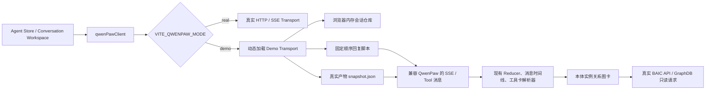

# QwenPaw Mock 交接文档

## 1. 文档目的

本文用于交接 Agent Workspace 的独立 Demo Mock 模式。该模式在不启动、不连接 QwenPaw
服务的情况下，使用浏览器内存会话、固定回复脚本和“多媒体中心功能规范
V1.0-20250722”真实产物快照，演示现有消息时间线、流程面板和结构化工具结果卡。

实现遵循以下边界：

- Demo 模式不向 QwenPaw 发起 Agent、会话、聊天、历史或附件上传请求。
- BAIC 项目列表、项目创建和项目删除仍访问现有 BAIC 后端。
- 最终“本体实例关系图”卡片仍通过现有只读接口实时访问项目需求 API 和 GraphDB。
- TTL 上传、GraphDB 写入和本体推理步骤仅回放历史结果，不执行真实外部写操作。
- Demo 会话只存在于当前页面内存中，刷新页面后清空。
- 普通模式默认仍走真实 QwenPaw，不加载 Demo 快照。

## 2. 快速进入 Demo 模式

### 2.1 开发环境

在仓库根目录执行：

```powershell
npm run dev:demo
```

随后打开 Vite 页面，进入 Agent Store 并选择一个真实 BAIC 项目。页面头部应显示
“演示模式”。Agent Store 根节点同时具有：

```text
data-qwenpaw-mode="demo"
```

Demo 环境配置位于：

```text
packages/webview/.env.demo
```

核心开关为：

```text
VITE_QWENPAW_MODE=demo
```

### 2.2 Demo 构建脚本

如需由维护者或 CI 构建，可使用：

```powershell
npm run build:webview:demo
npm run build:demo-extension
```

本次实现和交接不代表已完成浏览器或 VS Code Extension 人工验收，验收结果应填写在
`helps/AgentWorkspace_Demo_Mock_手工验证用例.md`。

### 2.3 返回真实模式

使用普通启动脚本即可：

```powershell
npm run dev
```

当 `VITE_QWENPAW_MODE` 未设置为严格的 `demo` 时，代码按 `real` 模式处理，继续使用原
QwenPaw HTTP/SSE、会话历史和上传链路。

## 3. 总体架构



页面层不需要了解真实客户端和 Mock 客户端的具体差异。两者统一实现
`QwenPawTransport`：

- `fetchAgents`
- `fetchChats`
- `fetchChatHistory`
- `uploadFile`
- `streamChat`

`qwenPawClient.ts` 在真实模式直接使用 HTTP/SSE transport；在 Demo 模式通过动态
`import()` 加载 `demo/demoTransport.ts`。因此普通真实模式不会主动打包加载 Demo
快照资源。

## 4. 关键文件

| 文件 | 职责 |
|---|---|
| `packages/webview/.env.demo` | Demo Vite 环境变量；保留 BAIC 后端地址并启用 QwenPaw Demo 模式 |
| `packages/webview/src/components/AgentWorkspace/qwenPaw/qwenPawMode.ts` | 定义 `real/demo` 模式并提供统一判断函数 |
| `packages/webview/src/components/AgentWorkspace/qwenPaw/transport.ts` | 真实与 Demo 客户端共同遵守的 transport 接口 |
| `packages/webview/src/components/AgentWorkspace/qwenPaw/qwenPawClient.ts` | transport 选择边界；Demo transport 在此动态加载 |
| `packages/webview/src/components/AgentWorkspace/qwenPaw/demo/demoTransport.ts` | 内存 Agent、会话、历史、上传、固定脚本和模拟 SSE 的核心实现 |
| `packages/webview/src/components/AgentWorkspace/qwenPaw/demo/snapshot.json` | 运行时真实产物快照，不依赖原始绝对路径 |
| `packages/webview/scripts/generate-agent-demo-snapshot.mjs` | 从“多媒体中心”真实产物重新生成快照并执行统计门禁 |
| `packages/webview/src/pages/AgentStore.tsx` | 输出 Demo DOM 标识，并继续管理真实 BAIC 项目 |
| `packages/webview/src/components/AgentWorkspace/ConversationWorkspace/ConversationHeader.tsx` | 显示“演示模式”徽标 |
| `helps/AgentWorkspace_Demo_Mock_手工验证用例.md` | 完整人工验收表格 |

## 5. Demo Agent 与固定脚本

Demo 只提供两个 Agent：

| Agent ID | 界面名称 | 用途 |
|---|---|---|
| `tqqRiu` | 本体入库智能体 · Demo | 回放文档条目化、五个功能 DSL 建模、本体管理和关系图入口 |
| `ontology_qa` | 本体问答智能体 · Demo | 回放场景 9 推理结果和场景 10 蓝牙音乐关系查询 |

### 5.1 `tqqRiu` 固定顺序

1. 文档条目化完成摘要。
2. 返回完整 `chunks` 围栏，复用现有 chunks 卡片解析器。
3. 在线音乐建模回放。
4. 在线电台建模回放。
5. 收音机建模回放。
6. 蓝牙音乐建模回放。
7. U盘音乐建模回放。
8. 返回需求六维 DSL 模型工具结果卡。
9. TTL 转换与本地校验回放。
10. GraphDB 上传回放，不执行上传或清库。
11. 本体推理回放，不执行真实推理。
12. 触发本体实例关系图工具卡；该卡仍实时访问 GraphDB。
13. 完成提示，要求新建对话后重新开始。

### 5.2 `ontology_qa` 固定顺序

1. 场景 9 本体推理摘要回放。
2. 返回完整推理结果工具卡。
3. 场景 10“蓝牙音乐”关系查询摘要回放。
4. 返回完整功能关系工具卡。
5. 完成提示，要求新建对话后重新开始。

用户输入文字不会改变脚本分支。步骤由当前会话已成功提交的用户轮次数决定。

## 6. 会话、停止与重试语义

### 6.1 隔离规则

Demo 会话以请求中的以下信息组合隔离：

```text
project user_id + agentId + sessionId
```

当前聊天的 `user_id` 含 BAIC `projectId`，所以项目、Agent、会话三个层级不会共享脚本
游标或历史。Agent Workspace 本身还使用项目、Agent、session 组合 key 重新挂载工作区，
避免草稿和流程状态串用。

### 6.2 新建会话与刷新

- “新建对话”会产生新的 `sessionId`，从目标 Agent 的第一步开始。
- 旧会话在当前页面运行期间仍可从侧栏切换并继续。
- 页面刷新会重建 JS 运行环境，内存会话、历史和脚本游标全部清空。
- Demo 不使用 `localStorage`、IndexedDB 或 BAIC 数据库持久化 QwenPaw 历史。

### 6.3 停止与重试

每一步只有在模拟 SSE 完整发送终态后才写入 Demo 历史。中途停止会触发
`AbortSignal`：

- 当前会话恢复 `idle`。
- 未完成步骤不写入历史，因此游标不推进。
- 重试会重新生成同一步。
- 成功后该步骤只推进一次。

### 6.4 附件

Demo 上传返回形如 `demo-upload://...` 的本地模拟 URL，仅保留文件名和大小，不发送
QwenPaw 上传请求，也不把文件写入 Demo 快照。

## 7. SSE 与工具结果兼容策略

Mock 没有新建一套消息渲染协议，而是产生与真实 QwenPaw 客户端兼容的事件：

- `object=message` / `status=in_progress`
- `object=content` / `type=text` 的短延迟增量文本
- `object=response` / `status=completed`
- 工具消息使用 `plugin_call` 与 `plugin_call_output`

同一个工具步骤的调用和结果使用相同 `call_id`：

```text
demo-call:<session_id>:<step_id>
```

工具名保持为 `execute_shell_command`，command 中保留对应 Skill 脚本名。这样现有
`conversationReducer`、工具注册表、工具结果解析器和卡片组件无需 Demo 专用分支即可
工作。当前回放覆盖：

- chunks 结构化卡片；
- Requirement DSL v2 六维模型卡片；
- 本体推理结果卡片；
- 功能关系卡片；
- 本体实例关系图卡片。

## 8. 真实快照数据

快照来自：

```text
E:\baic-frontend\智能化需求建模\测试结果001\多媒体中心功能规范V1.0-20250722
```

该绝对路径只在重新生成快照时使用。运行中的 Webview 只读取已经提交的
`snapshot.json`。

当前快照统计门禁：

| 数据 | 数量 |
|---|---:|
| 分块 | 7 |
| 可建模功能 | 5 |
| requirement_id | 124 |
| 六维 DSL 模型 | 112 |
| 需求到模型映射 | 311 |
| IBD / ESD / BDD / ISD / SC / UI | 5 / 81 / 0 / 0 / 16 / 10 |
| 显式项目关系 | 10 |
| 推理依赖 | 3 |
| 候选冲突 | 1 |
| 状态机问题 | 21 |

快照还包含完整 chunks、五个功能 Markdown 及建模产物、需求/DSL 映射、测试映射、TTL、
推理 TTL、推理报告和结构化卡片协议数据。PDF、XLSX、备份目录及生成脚本不进入运行时
快照。

## 9. 如何更新快照

当“多媒体中心”产物发生确认后的变更时，在仓库根目录执行：

```powershell
node packages/webview/scripts/generate-agent-demo-snapshot.mjs `
  "E:\baic-frontend\智能化需求建模\测试结果001\多媒体中心功能规范V1.0-20250722"
```

生成器会：

1. 读取允许进入快照的真实产物。
2. 计算源文件 SHA-256 清单。
3. 生成协议 v2 Requirement DSL 六维模型数据并收录 DialogMap。
4. 校验固定统计与协议结构。
5. 只有校验全部通过后才覆盖 `snapshot.json`。

若真实产物确实发生了经确认的数量变化，应先人工核对原因，再同步更新生成器末尾的
`expected` 门禁、Demo 回复文案和手工验证用例。不要只为了让生成器通过而修改期望值。

## 10. 网络边界

| 能力 | Demo 模式行为 |
|---|---|
| QwenPaw Agent 列表 | 内存固定数据，不请求 QwenPaw |
| QwenPaw 会话列表/历史 | 浏览器内存数据，不请求 QwenPaw |
| QwenPaw 聊天 SSE | 本地异步生成器模拟 |
| QwenPaw 附件上传 | 返回 `demo-upload://` 模拟结果 |
| BAIC 项目列表/创建/删除 | 真实 BAIC 后端请求 |
| chunks、DSL、推理、功能关系卡 | 读取本地快照 |
| TTL 上传、GraphDB 写入、推理执行 | 仅文字回放，不执行 |
| 本体实例关系图 | 真实项目需求 API 和 GraphDB 只读请求 |

人工验证时，应在浏览器 Network 中确认没有以下 QwenPaw 请求：

```text
/qwenpaw/api/agents
/qwenpaw/api/console/chat
/qwenpaw/api/console/upload
/qwenpaw/api/agents/<agentId>/chats
```

加载 Vite 打包后的本地 `snapshot.json` 资源属于预期行为。

## 11. 已知限制

- Demo 是固定脚本回放，不理解用户输入，也不提供自由问答。
- 所有会话状态仅保存在内存；刷新后无法恢复此前 Demo 历史。
- 模拟流式回复使用短固定延迟，不能代表真实 QwenPaw 性能。
- 附件只模拟上传协议，不解析文件内容。
- GraphDB 离线时，只有最终本体实例关系图会失败；其他快照卡片应保持可用。
- Demo 模式仍依赖 BAIC 后端提供项目，因此不是完全脱离后端的静态页面。
- Requirement DSL 卡中的编辑是工具卡本地沙盒，不写回 BAIC 或源 DSL。

## 12. 常见问题排查

### 页面没有“演示模式”标识

检查是否使用了 `npm run dev:demo`，并在页面根节点确认
`data-qwenpaw-mode="demo"`。Vite 模式在启动时确定，修改 `.env.demo` 后需要重启开发
服务。

### 仍然出现 QwenPaw 请求

确认实际加载的 Webview 是 Demo 构建产物，而不是此前普通模式的旧 `dist/media`。
同时检查 `VITE_QWENPAW_MODE` 是否严格等于 `demo`。

### 流程顺序与预期不一致

Demo 游标按当前会话中已完成的用户轮次数计算。新建会话可重置脚本；刷新页面可清空
全部 Demo 内存状态。

### 工具卡没有渲染

检查 `demoTransport.ts` 中的 Skill 脚本名、`plugin_call` 和
`plugin_call_output` 是否仍使用同一个 `call_id`，以及对应工具解析器是否仍通过脚本名
识别消息。

### 只有关系图报错

这是允许的边界。先检查 BAIC 项目需求 API、GraphDB 服务、仓库名称和数据是否可用；不要
把该错误归因于 QwenPaw Mock。

### 更新快照时报统计不一致

生成器故意中止写入。应核查真实产物是否新增、删除或调整了 requirement、DSL、
DialogMap、关系或推理结果，再决定是否更新统计门禁和验收文档。

## 13. 交接检查清单

- [ ] 使用 `npm run dev:demo` 启动后可以看到“演示模式”。
- [ ] Network 中没有 QwenPaw Agent、聊天、会话历史和上传请求。
- [ ] `tqqRiu` 可以按顺序完成 13 个固定步骤。
- [ ] `ontology_qa` 可以按顺序完成 5 个固定步骤。
- [ ] chunks、六维 DSL、推理结果和功能关系四类卡片正常解析。
- [ ] 停止不推进游标，重试重复当前步骤。
- [ ] 新建会话、Agent 切换和项目切换彼此隔离。
- [ ] GraphDB 在线时最终关系图可加载；离线时不影响其他 Demo 卡片。
- [ ] 使用普通 `npm run dev` 时不显示 Demo 标识并继续走真实 QwenPaw。
- [ ] 验收人已填写 `helps/AgentWorkspace_Demo_Mock_手工验证用例.md`。

## 14. 后续维护原则

1. 保持页面只依赖 `QwenPawTransport`，不要在业务组件中散布 Demo 网络判断。
2. 新增工具卡回放时继续复用真实 `plugin_call/plugin_call_output` 和 `call_id` 协议。
3. 所有会产生外部副作用的回复必须明确标注“Demo 回放”，且不得在 Mock 内执行写操作。
4. 真实产物变化应通过快照生成器进入仓库，不要手工编辑大型 `snapshot.json`。
5. 保持 Demo 快照动态加载，避免普通真实模式无条件加载大体积演示数据。
6. 修改流程顺序时同步更新固定脚本、流程面板证据判断、回复文案和手工验证用例。
7. 不应使用 Demo 通过来替代真实模式 QwenPaw、GraphDB 或 Extension 集成验收。
