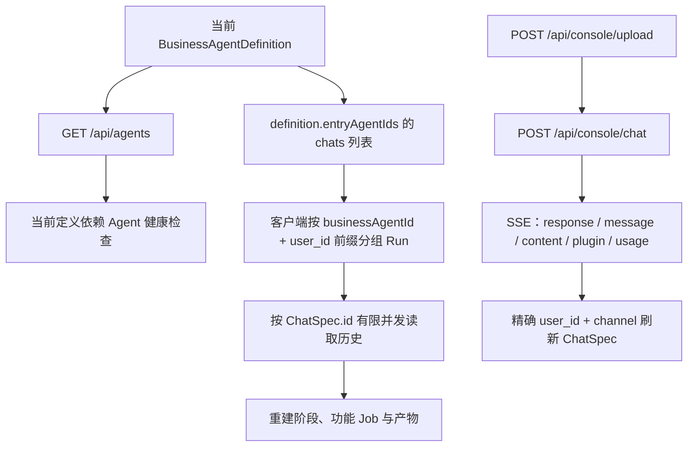

# QwenPaw API 能力核对与计划映射

## 核对范围

本文件依据以下项目内文档完善多业务智能体任务工作台及首个本体入库工作流计划：

- [QwenPaw RESTful API 调用指南](../../QwenPaw%20RESTful%20API%20调用指南.md)
- [QwenPaw Agent Session RESTful API 调用文档](../../QwenPaw%20Agent%20Session%20RESTful%20API%20调用文档.md)

Session 文档对应 QwenPaw Desktop `1.1.12.post3` 的本地实现。后续若升级 QwenPaw，应先重新核验接口和事件结构，再实施依赖变更。

## 第零阶段：当前实例契约冒烟

编码前先用隔离的测试 `user_id / session_id` 核对实际运行实例：

1. `GET /api/version`：记录实际版本；若不是文档对应版本，暂停并重新核对接口。
2. `GET /api/agents`：确认所有正式注册业务智能体声明的目标 Agent ID、`enabled` 和 `active_model`；当前本体定义为 12 个。
3. 对当前定义的入口 Agent 分别读取 chats 列表，确认响应为 ChatSpec 数组；本体定义为三个入口。
4. 向一个隔离测试会话发送 Text + Data，记录完整 SSE 事件类型及 response 终态。
5. 用精确 `user_id + channel` 找到新 ChatSpec，确认 `id` 与 `session_id` 的区别。
6. 用 `ChatSpec.id` 读取详情，确认返回 `messages + status`。
7. 上传一个小型 Markdown，确认 `{ url, file_name, size }`，再用 Text + FileContent 发送。
8. 记录 403、404、空历史和 SSE 缺终态时的实际错误体。

第零阶段只使用专用测试标识，不复用用户正式 Run。冒烟结果通过人工确认后再实现第一阶段；实际契约与文档不一致时，以受控实测为准并同步更新本文件。

### 2026-07-30 当前实例实测

- 实例地址：`http://localhost:42112`；版本为 `1.1.12.post3`。
- `/api/agents` 返回 15 个 Agent；本体定义声明的 12 个 Agent 全部存在、启用并配置
  `active_model`。
- 三个入口 Agent 的 chats 接口均返回 ChatSpec 数组。
- 隔离的 Text + Data 请求返回 `200 text/event-stream`，共 53 个事件，最终收到
  `response:completed`；随后可通过精确 `user_id + channel` 找到 ChatSpec。
- 新 ChatSpec 的 `id` 与请求使用的 `session_id` 不同；详情必须使用 `id`，详情返回
  `messages + status`。
- Markdown 上传返回 `{ url, file_name, size }`，其中当前本机实例的 `url` 是 QwenPaw
  workspace 下的 Windows 本地路径。该值只作为后续 `FileContent.file_url` 输入，不得
  直接渲染成浏览器链接。
- Text + FileContent 请求返回完整 SSE 终态。
- 不含 TextContent 的 Data-only 请求稳定复现 `HTTP 200 + 0 字节 SSE + 无 response
  终态`，前端必须继续将其视为协议错误。
- 不存在的 Agent 与 Chat 均返回 `404` JSON `detail`。全部目标 Agent 当前已启用，
  因此未通过修改配置诱导 `403`；也未破坏底层 Session 文件以诱导空历史。
- 完整证据、隔离会话标识和 payload 体积见
  [phase-0-contract-smoke-report.md](./phase-0-contract-smoke-report.md)。

## 能力矩阵

| QwenPaw 能力 | 文档结论 | 本计划用途 | 实施约束 |
| --- | --- | --- | --- |
| `GET /api/agents` | 支持 | 校验当前业务智能体依赖的 Agent 是否存在、启用及模型状态 | 始终使用返回的 `agents[].id`，不使用显示名称 |
| `POST /api/console/chat` | 支持，推荐 SSE | 启动流水线、继续 Job、发送确认 | `X-Agent-Id` 指向当前入口 Agent；新任务使用新 `session_id` |
| TextContent | 支持 | 携带非空操作意图和补充指令 | 任意非文本内容前都附带非空文本 |
| DataContent | 已验证进入处理链路 | 携带 Run、项目、流水线、功能及不含敏感凭据的授权上下文 | `data` 必须为可序列化 JSON；仍由 Agent/前端协议解释 |
| ImageContent | 已验证 URL/Data URI | 可选的截图或图示补充 | 依赖模型多模态能力，不作为标准流程前置条件 |
| `POST /api/console/upload` | 支持 | 上传 DOCX/PDF/MD 和用户补充附件 | 使用 FormData；不手写 multipart Content-Type |
| FileContent.file_url | 已验证支持 | 将上传结果传给入口 Agent | 使用响应 URL 和 `file_name`；不使用 `file_data` |
| SSE 多事件流 | 支持 | 流式文本、Agent 工具活动、错误和请求终态 | 持续消费到流结束，不能只读第一个事件 |
| `GET /api/agents/{agentId}/chats` | 支持 | 发现当前业务智能体入口 Agent 下的聚合 Run | 无分页、无排序、无前缀筛选；客户端过滤排序 |
| `?user_id=&channel=` | 支持精确筛选 | 首次发送后查找刚登记的 ChatSpec、打开已知 Run 时缩小查询 | 不能用项目/Run 前缀做模糊查询 |
| `GET /api/agents/{agentId}/chats/{chat_id}` | 支持 | 恢复单个 Job 的完整消息历史 | `{chat_id}` 必须是 `ChatSpec.id`，不是 `session_id` |
| ChatSpec 元数据 | 支持 | 任务索引、更新时间、运行提示、跨 Agent 分组 | `idle/running` 不是业务流水线状态 |
| 扫描全部底层 Session | 不支持 | 不使用 | 未登记 Session 无法通过 REST 历史发现 |
| 批量返回全部历史 | 不支持 | 不使用 | 打开 Run 后按需、有限并发读取详情 |
| ChatSpec 分页/排序 | 不支持 | 不使用 | 前端按 `updated_at` 排序并承担全量列表成本 |
| 独立创建 Session | 文档未提供 | 不使用 | 首次 chat 请求促成会话登记 |
| 重命名/删除/置顶会话 | 文档未提供写接口 | 不使用 | 任务标题由前端派生；旧会话只隐藏不修改 |

## 现有前端能力复用

当前仓库已经覆盖大部分基础 API，不应为本体入库流程再写一套客户端：

| 现有实现 | 已覆盖能力 | 本计划处理 |
| --- | --- | --- |
| `config/api.ts` 的 `QWENPAW_ENDPOINTS` | Agent、ChatSpec 列表/详情、chat、upload、精确筛选参数 | 保持统一端点配置，不在新组件拼 URL |
| `qwenPawClient.fetchAgents` | Agent 结构校验 | 复用于各业务智能体定义的依赖健康检查 |
| `fetchChats / fetchChatHistory` | ChatSpec 与历史读取 | 在通用 Run Hook 中跨当前定义入口 Agent 编排并限制详情并发 |
| `uploadFile` | FormData 上传和响应校验 | 复用于引导表单和当前 Job 附件 |
| `streamChat` | SSE、response 终态和错误分类 | 复用于每个 Pipeline Job，不复制 SSE 读取器 |
| `useQwenPawConversation` | 新会话登记、继续、停止、重试 | 抽取/扩展为接收业务智能体定义和 Job 身份的工作流控制器 |
| `normalizeMessages` | Text/Data/File/Tool 消息归一化 | 继续作为 fenced/tool 协议进入 UI 的唯一消息入口 |

新增工作集中在“业务智能体注册、按定义聚合入口 Agent、通用工作流状态以及各定义的业务协议/产物门禁”，而不是替换已经可用的 HTTP、上传和 SSE 基础层。

## 页面功能到 API 的映射



## 标准请求设计

### 本体工作流首次请求示例

```json
{
  "input": [
    {
      "role": "user",
      "content": [
        {
          "type": "text",
          "text": "请执行本体入库流水线，并遵守附带的结构化输出协议。"
        },
        {
          "type": "data",
          "data": {
            "business_agent_id": "ontology-ingestion",
            "run_id": "uuid",
            "project_id": "project-id",
            "step_id": "itemization",
            "job_id": "itemize",
            "output_root": "...",
            "goal": "..."
          }
        },
        {
          "type": "file",
          "filename": "requirements.pdf",
          "file_url": "<upload-response-url>"
        }
      ]
    }
  ],
  "stream": true,
  "session_id": "baic-agent:ontology-ingestion:{runId}:itemize",
  "user_id": "baic-project:{projectId}:agent:ontology-ingestion:run:{runId}",
  "channel": "console"
}
```

请求头：

```http
Content-Type: application/json
Accept: text/event-stream
X-Agent-Id: requirement_itemizer
```

其他步骤或业务智能体由定义替换 `X-Agent-Id`、`business_agent_id`、`step_id`、`job_id` 和 `session_id`。同一个 Job 的继续、重试或确认消息复用原 `session_id / user_id / channel`，不能生成另一套上下文标识。

### 文件上传

1. 使用当前消费文件的入口 Agent ID 调用 `/api/console/upload`。
2. 读取 `{ url, file_name, size }` 并核对响应结构。
3. 聊天内容映射为 `{ type: "file", filename: file_name, file_url: url }`。
4. 同一 content 数组必须带非空 TextContent。

文档没有承诺上传 URL 的跨 Agent 作用域或永久有效性，也没有提供从 Agent 本地目录
下载构建产物的接口。因此标准流程在每个入口 Agent 的首次任务消息中明确
`project_root/output_root`，后续由该会话中的查询 Skill 在 Agent 侧读取本地产物，再
通过 fenced/tool 消息返回。确需原文件时针对目标入口 Agent 重新上传，不能把上传
URL 或本地路径当作跨 Agent artifact URI。具体见
[07-skill-artifact-integration.md](./07-skill-artifact-integration.md)。

## Session 发现与恢复

### 首次登记

QwenPaw 没有独立“创建 ChatSpec”接口。前端流程为：

1. 生成本地 Run 和 Job 标识。
2. 用新 `session_id` 发起首次聊天。
3. SSE 请求结束后，以完整 `user_id + channel` 查询该入口 Agent 的 chats。
4. 用 `session_id` 匹配新 ChatSpec，并保存其 `id`。
5. 在服务端登记可见前显示 `pending`，进行有上限的短轮询/刷新，不创建重复 Job。

### 项目任务索引

由于服务端只支持精确 `user_id`：

1. 分别读取当前业务智能体定义的入口 Agent 完整 ChatSpec 列表。
2. 客户端按当前 `projectId + businessAgentId` 的 `user_id` 前缀过滤。
3. 按完整 `user_id` 在当前业务智能体入口 Agent 间分组。
4. 由当前定义的 identity adapter 按 `session_id` 解析 Job；本体定义定位 itemize、N 个 function job 和 ontology job。
5. 按组内最大 `updated_at` 排序。

不能将 `baic-project:{projectId}:agent:{businessAgentId}:run:` 作为服务端筛选参数，因为它不是完整 user ID。

### 历史详情

- 列表只用于任务索引，不读取全部历史。
- 用户打开 Run 后，以并发上限 2 请求组内 ChatSpec 详情。
- 详情 URL 使用 `ChatSpec.id`。
- 继续会话使用 ChatSpec 中的 `session_id / user_id / channel`。
- 详情只返回 `messages + status`，前端负责与 ChatSpec 元数据合并。
- `200 + messages: []` 表示登记存在但底层状态可能不存在，不能推断任务完成。

## SSE 处理契约

QwenPaw SSE 可能包含 response、message、content、plugin call/output 和 turn usage。工作流实现遵循：

1. 持续解析全部 `data:` 事件，包括多行 data。
2. 按 `sequence_number` 和现有消息归一化规则合并增量。
3. 只有 response 的 `completed/failed` 是本次请求终态。
4. 请求终态不等于业务终态；业务终态还必须出现合法 `agent-workflow` 协议、匹配的 `business_agent_id` 及对应产物。
5. 流关闭但缺少 response 终态时返回协议错误。
6. 使用 AbortController；长任务超时不少于 120 秒，并根据有效事件活动刷新等待。

## 认证与部署边界

- 本机 localhost 通常不需要 Authorization。
- 远程 Web 认证可能需要 Bearer Token。
- Token 不进入前端源码、Vite 环境产物或浏览器存储。
- 远程场景通过同源代理/反向代理注入 Token，并确保 SSE 不被代理缓冲。
- QwenPaw 基础地址继续使用现有运行时配置，不在组件中写死 `http://localhost:7706`。

## 错误映射

| 情况 | 前端处理 |
| --- | --- |
| 403 Agent disabled | 标记具体 Agent 禁用，阻断相关流水线 |
| 404 Agent not found | 重新加载 Agent 清单，显示缺失 ID |
| 404 Chat not found | 刷新 ChatSpec；禁止用 `session_id` 重试详情 URL |
| 500 管理器/加载失败 | 保留 Run 上下文，提供稍后重试 |
| HTTP 200 但 SSE 无事件 | 检查是否遗漏非空 TextContent，避免重复发送 |
| SSE 无 response 终态 | 标记当前请求未知/失败，先刷新历史再决定是否继续 |
| 上传成功但 Agent 未读取 | 核对 `filename/file_url`、文本意图、Agent 工具和文件格式 |

## 对实施范围的直接影响

1. 不新增 Session CRUD 客户端，也不在 UI 提供远端任务删除/重命名/置顶。
2. 新建任务状态机必须包含 `draft → sending → registration_pending → registered`。
3. Run 索引读取当前定义入口 Agent 的全量 ChatSpec，因此必须懒加载历史、客户端排序，并按 `projectId + businessAgentId` 短期缓存。
4. Run 详情读取采用有限并发，不使用 `Promise.all` 无上限拉取 N 个功能历史。
5. 引导表单首条请求优先使用 Text + Data + File 的组合，充分利用 QwenPaw Content 能力。
6. SSE 请求终态和业务阶段终态分层处理。
7. 上传 URL、ChatSpec 顺序、未登记 Session 和模型文件理解能力都视为非保证项。
