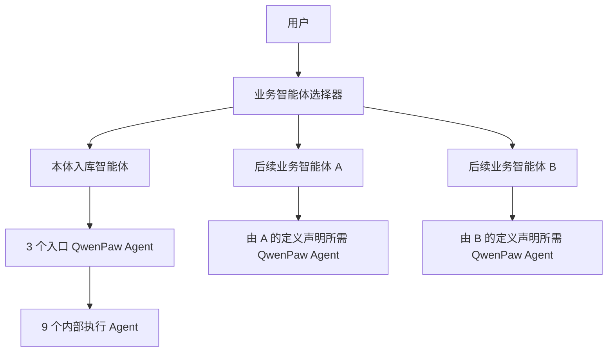

# 多业务智能体扩展设计

## 目标

`/agent/store` 最终承载三个用户可见的业务智能体。当前只确定“本体入库智能体”的详细流程，另外两个智能体尚未给出名称和能力，因此先锁定扩展契约：

- 通用页面壳不感知某个智能体的具体业务。
- 每个业务智能体通过注册定义声明自身能力。
- 只有无法通用化的表单、产物或授权步骤使用专用扩展组件。
- 新增智能体不复制页面、不新增路由、不修改通用 reducer 的状态枚举。

本计划将“后续两个智能体”理解为两个新的用户可见业务智能体，因为问题指向当前页面只适配“本体入库智能体”。如果后续确认它们只是本体工作流内部新增的 QwenPaw 执行 Agent，则不增加业务智能体入口，只需更新 `ontologyIngestionDefinition.requiredAgentIds`、步骤职责和健康检查。

## 两层 Agent 模型



页面对用户展示业务智能体；QwenPaw Agent ID 只用于执行、健康检查和审计时间线。

## 目录边界

```text
packages/webview/src/components/AgentWorkspace/
├─ AgentTaskWorkspace/
│  ├─ AgentTaskWorkspace.tsx
│  ├─ BusinessAgentSelector.tsx
│  ├─ AgentTaskSidebar.tsx
│  ├─ WorkflowStepper.tsx
│  ├─ WorkflowStarter.tsx
│  ├─ ExecutionTimeline.tsx
│  ├─ ArtifactCenter.tsx
│  └─ *.css
├─ workflowCore/
│  ├─ types.ts
│  ├─ registry.ts
│  ├─ workflowIdentity.ts
│  ├─ workflowReducer.ts
│  ├─ useAgentTaskRuns.ts
│  └─ useAgentTaskWorkflow.ts
└─ workflows/
   ├─ ontologyIngestion/
   │  ├─ definition.ts
   │  ├─ prompt.ts
   │  ├─ protocolAdapter.ts
   │  ├─ FunctionBatchPanel.tsx
   │  ├─ GraphDbAuthorizationPanel.tsx
   │  └─ artifactRenderers.tsx
   ├─ futureAgentA/
   └─ futureAgentB/
```

`futureAgentA/B` 不在本轮创建空生产目录；这里仅表示后续接入位置。

## 业务智能体定义

```ts
interface BusinessAgentDefinition {
  id: string
  name: string
  description: string
  icon: ReactNode
  requiredAgentIds: string[]
  entryAgentIds: string[]
  starter: StarterDefinition
  steps: WorkflowStepDefinition[]
  artifactGroups: ArtifactGroupDefinition[]
  artifactQueries: ArtifactQueryBinding[]
  buildInitialRequest: WorkflowRequestBuilder
  buildContinuationRequest: WorkflowRequestBuilder
  protocolAdapter?: WorkflowProtocolAdapter
  extensions?: {
    starter?: ComponentType<StarterExtensionProps>
    stepPanels?: Record<string, ComponentType<StepPanelProps>>
    artifactRenderers?: Record<string, ComponentType<ArtifactProps>>
  }
}
```

定义注册：

```ts
registerBusinessAgent(ontologyIngestionDefinition)
```

后续两个智能体只需各自注册定义。注册表在开发模式检查 ID 唯一、步骤唯一、入口
Agent 属于依赖清单、产物分组存在、查询绑定的 Skill/handler 唯一且入口 Agent 合法，
以及协议版本兼容。

## 本体入库定义

`ontologyIngestionDefinition` 声明：

- `id = "ontology-ingestion"`。
- 12 个 `requiredAgentIds`。
- 3 个 `entryAgentIds`。
- 文档、Markdown、输出目录、项目和目标表单。
- `itemization / function-modeling / ontology` 三个步骤。
- 条目化、DSL/测试用例、TTL/关系三个产物组。
- `query-project-chunks`、`query-requirement-dsl-artifacts`、
  `query-project-ontology-instances` 三个现有查询绑定，以及第三阶段新增的建模 v2 /
  本体本地产物查询绑定。
- 功能多选批处理面板。
- GraphDB 授权专用步骤面板。
- chunks、DSL artifact 和 ontology instance 专用渲染器。

通用壳只渲染这些声明，不直接 import GraphDB 或本体组件。

## 通用任务标识

统一改为：

```text
businessAgentId = ontology-ingestion
runId = crypto.randomUUID()
user_id = baic-project:{projectId}:agent:{businessAgentId}:run:{runId}
session_id = baic-agent:{businessAgentId}:{runId}:{jobId}
channel = console
```

这样三个业务智能体天然分区。任务聚合键为：

```text
projectId + businessAgentId + runId
```

当前计划尚未形成正式的 `ontology-run` 远端数据；若实施前发现已有试运行数据，则增加只读 legacy identity adapter，将旧前缀映射到 `ontology-ingestion`，不批量改写 ChatSpec。

## 页面选择与恢复

- 当前项目仍是一级上下文。
- 项目下增加业务智能体选择器，展示名称、描述、可用性和未处理任务数。
- 当前选择写入 `/agent/store?agent={businessAgentId}`，刷新可恢复；无效 ID 回退到第一个可用定义。
- 新建按钮使用当前定义的名称，例如“新建本体入库任务”。
- 任务历史只查询当前定义的 `entryAgentIds`，并按通用 `user_id` 前缀过滤。
- 切换业务智能体会停止当前浏览器 SSE，但不会删除或远端停止另一个智能体的任务。
- 切回后从 ChatSpec 和历史恢复。

## 通用与专用边界

| 能力 | 通用核心 | 本体扩展 |
| --- | --- | --- |
| 业务智能体选择 | 是 | 仅提供定义数据 |
| 项目选择/CRUD | 是 | 否 |
| Run 身份与历史聚合 | 是 | 提供入口 Agent 清单 |
| SSE、上传、消息归一化 | 是 | 否 |
| 表单容器与基础字段 | 是 | 声明字段或提供扩展字段 |
| 步骤条与状态 | 是 | 声明三步骤 |
| 时间线与 Job 卡 | 是 | 功能批处理面板 |
| 产物中心 | 是 | 本体 artifact renderer |
| 用户确认门禁 | 是 | GraphDB 授权表单与规则 |
| 协议信封 | 是 | 本体业务 payload 校验 |

## 通用工作流协议

公共 fenced 协议使用 `agent-workflow`，至少包含：

```json
{
  "protocol_version": "1.0",
  "business_agent_id": "ontology-ingestion",
  "run_id": "uuid",
  "project_id": "project-id",
  "step_id": "itemization",
  "job_id": "itemize",
  "status": "running",
  "artifacts": [],
  "next_action": "none",
  "payload": {}
}
```

公共解析器校验信封与身份；当前业务智能体的 `protocolAdapter` 校验 `payload`、artifact kind 和 `next_action`。因此后续智能体可以复用状态机而不把所有业务字段塞入公共类型。

## 后续两个智能体的接入步骤

当用户提供其名称和业务说明后，每个智能体按以下步骤接入：

1. 确认入口/内部 QwenPaw Agent ID 与 API 可用性。
2. 定义表单、步骤、Job 拆分、确认门禁和正式产物。
3. 注册 `BusinessAgentDefinition`。
4. 实现必要的 prompt builder 和 protocol adapter。
5. 只有新 artifact 无法由通用卡展示时才新增 renderer。
6. 增加该定义的历史聚合、刷新恢复、错误和人工验收 fixture。
7. 验证切换到其他智能体后项目上下文不变、任务历史不串线。

## 扩展性验收

本轮不虚构另外两个正式智能体，但使用两个仅测试可见的 fixture definition 验证：

1. 一个单步骤、无文件、无专用产物的简单智能体。
2. 一个两步骤、需要人工确认和自定义 artifact 的智能体。
3. 三个定义可在选择器中切换。
4. 通用步骤条能渲染 1、2、3 个步骤。
5. 通用历史聚合按 `businessAgentId` 隔离。
6. fixture 卸载后不出现在生产 UI。
7. 添加 fixture 不修改 `AgentStore.tsx`、通用 reducer 或本体定义。

通过上述验收后，才能认为页面确实支持后续两个业务智能体，而不只是给本体页面增加了一个下拉框。
