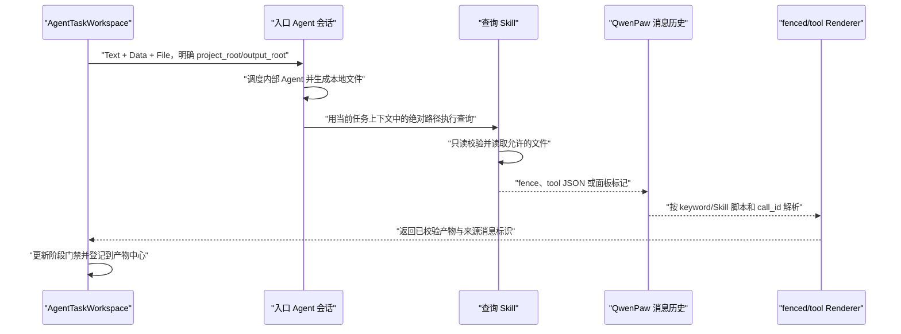

# Skill 驱动的本地产物查询与回看

## 结论

本工作流不让 Webview 读取 Agent 返回的本地绝对路径。`project_root`、`output_root`
及具体文件路径只在对应 QwenPaw 会话和 Skill 执行环境中使用。Skill 在 Agent 侧读取
本地文件，再通过已经注册的 fenced message、tool message 或前端数据面板把结果交给
Webview。

`agent-workflow` 只负责步骤状态和产物索引，不复制大型产物，也不把本地路径当作
可打开的 `artifact.uri`。产物中心通过“查询绑定 + 来源消息”定位已有 Renderer。

## 当前 Skill 能力矩阵

| Skill | 流水线 | 本地读取 | 消息载体 | 当前 Renderer | 可作为门禁证据 | 当前缺口 |
| --- | --- | --- | --- | --- | --- | --- |
| `query-project-chunks` | 文档条目化 | `<project_root>/chunks.json` | 最终 assistant text 中的 `chunks` fence | `fencedMessage/chunks` | 是；`summary` 足以派生功能，`full` 用于查看正文 | 完整内容可能较大，默认必须使用 `summary` |
| `query-requirement-dsl-artifacts` | 单功能 DSL 建模 | 功能目录中的映射、需求和 DSL 文件 | `plugin_call_output` JSON | `toolMessage/requirementDslArtifacts` | 只能证明三类 DSL 可读取 | 尚不覆盖上下文、对齐结果和测试用例；当前总是返回完整 DSL |
| `query-project-ontology-instances` | 本体关系管理 | 不读取本地文件 | `plugin_call_output` 面板标记 | `toolMessage/ontologyInstances` | 只能证明关系面板可加载 | 不是 TTL、校验、上传和推理产物查询器 |

三个现有 Skill 保持原有 v1 契约，避免破坏已经落地的
`fencedMessage` / `toolMessage` 解析器和历史消息。协议扩展采用向后兼容版本或新增
Skill，并与对应前端 handler 在同一实施阶段交付。

## 工作流定义中的查询绑定

`BusinessAgentDefinition` 增加定义驱动的查询绑定，不在通用组件中硬编码 Skill 名称：

```ts
type ArtifactDelivery =
  | 'assistant-fence'
  | 'tool-output'
  | 'client-panel'

interface ArtifactQueryBinding {
  id: string
  stepId: string
  entryAgentId: string
  skillId: string
  delivery: ArtifactDelivery
  handlerId: string
  scope: 'job' | 'step'
  trigger: 'on-job-output-ready' | 'on-step-output-ready' | 'manual'
  sessionSelector: 'current-job' | 'latest-completed-step-job'
  variants?: Array<{
    id: string
    label: string
    detail: 'summary' | 'full' | 'filtered'
  }>
}
```

本体入库首版注册：

```ts
artifactQueries: [
  {
    id: 'itemization-chunks',
    stepId: 'itemization',
    entryAgentId: 'requirement_itemizer',
    skillId: 'query-project-chunks',
    delivery: 'assistant-fence',
    handlerId: 'chunks',
    scope: 'step',
    trigger: 'on-step-output-ready',
    sessionSelector: 'current-job',
    variants: [
      { id: 'summary', label: '查看功能摘要', detail: 'summary' },
      { id: 'full', label: '查看原始分块', detail: 'full' },
    ],
  },
  {
    id: 'requirement-dsl',
    stepId: 'function-modeling',
    entryAgentId: 'requirement_document_parse',
    skillId: 'query-requirement-dsl-artifacts',
    delivery: 'tool-output',
    handlerId: 'query-requirement-dsl-artifacts',
    scope: 'step',
    trigger: 'on-step-output-ready',
    sessionSelector: 'latest-completed-step-job',
  },
  {
    id: 'ontology-instances',
    stepId: 'ontology',
    entryAgentId: 'requirement_ontology_manager',
    skillId: 'query-project-ontology-instances',
    delivery: 'client-panel',
    handlerId: 'query-project-ontology-instances',
    scope: 'step',
    trigger: 'manual',
    sessionSelector: 'current-job',
  },
]
```

后续业务智能体只注册自己的查询绑定。通用产物中心只认识
`ArtifactQueryBinding`，不认识 `chunks`、DSL、TTL 或 GraphDB。

## 从本地构建到前端产物的执行时序



执行约束：

1. `project_root/output_root` 必须由用户在新任务表单中明确提供，并在各入口 Agent
   的首次任务消息中发送；Skill 不从当前工作目录猜测。
2. 自动查询发生在构建 Agent 报告本地文件已落盘之后、步骤宣告完成之前。
3. `query-project-chunks` 默认调用 `detail=summary`；只有用户查看原始分块时才发送
   `detail=full` 的继续消息。
4. `query-requirement-dsl-artifacts` 当前 v1 返回完整 DSL，因此第零阶段必须对标准
   项目的工具输出体积做实测；超过预算时不能直接上线批量查询。
5. `query-project-ontology-instances` 只在 GraphDB 写入成功后提供实时关系回看，不能
   替代本地 TTL 和校验证据。
6. 流水线二 v1 查询会扫描项目根目录下全部直接功能目录，只在批次输出就绪后从最近
   一个已完成的功能 Job 会话调用一次；不得在每个功能结束时重复返回累计的完整 DSL。
   v2 上线后改为按 `requirement_id/artifact_id` 在当前 Job 中做过滤查询。

## 产物索引与来源定位

`agent-workflow.artifacts` 的每一项改为声明逻辑产物及查询绑定：

```json
{
  "id": "itemization-chunks",
  "kind": "chunks",
  "name": "条目化与功能清单",
  "function_id": null,
  "status": "ready",
  "query_binding_id": "itemization-chunks",
  "payload_key": "chunks",
  "mime_type": "application/json",
  "summary": {
    "chunk_count": 26,
    "function_count": 8
  }
}
```

前端解析成功后补充只存在于运行态的来源信息：

```ts
interface ResolvedArtifactSource {
  chatSpecId: string
  sessionId: string
  messageId: string
  partKey: string
  handlerId: string
  queryBindingId: string
  variantId?: string
}
```

本地绝对路径、`file://` URL 和 QwenPaw 工作区路径不得写入
`ResolvedArtifactSource`、浏览器存储或 URL。现有消息标准化层会隐藏 Windows 本地
路径，浏览器也不能把它当作可读取资源。

## 产物中心的查看和恢复

### 已有消息中存在有效 payload

点击“查看”时直接定位来源消息并打开对应专用面板，不重新读取本地文件。页面刷新后，
通过 `ChatSpec.id` 加载历史，重新执行 fenced/tool 提取并重建
`ResolvedArtifactSource`。

### 只有产物索引，没有有效 payload

显示“需要重新查询”，而不是把本地路径渲染成链接。用户点击后：

1. 使用绑定的 `entryAgentId` 和原 Job 的 `session_id / user_id / channel` 继续会话。
2. 发送非空 TextContent，例如“请使用 `$query-project-chunks` 重新查询当前任务的
   summary 产物”；不把标准化后的隐藏路径回填给 Agent。
3. Agent 从同一会话的原始任务上下文取得用户明确提供的 `project_root`。
4. 收到新 fence/tool payload 后更新来源消息引用。

旧会话没有项目路径上下文、输出目录已删除或 Skill 返回错误时，产物保持
`unavailable` 并给出诊断，不猜测目录、不递归搜索，也不把步骤误标为完成。

### 下载能力

- fence/tool payload 中的文本产物支持查看和复制。
- 只有产物带受支持的 `http/https` URL 或后续增加受控文件桥接接口时才显示“下载”。
- QwenPaw 上传接口是浏览器到 QwenPaw 的输入通道，不是从 Agent 本地目录下载产物的
  接口。

## 流水线门禁与现有 Skill 的关系

### 流水线一

完成条件必须包含一个成功解析的 `query-project-chunks` `summary` payload。功能选择
直接从该 payload 派生。`agent-workflow` 中仅有一个 `chunks` 索引、但历史中没有有效
`chunks` fence 时，不得解锁流水线二。

### 流水线二

当前 `query-requirement-dsl-artifacts` 只能确认 Environment、ExternalScenario 和
Statechart DSL。它可作为 DSL 子门禁，不能单独证明“上下文、对齐、测试用例全部完成”。

第三阶段实施时同步交付以下兼容扩展：

1. `query-requirement-dsl-artifacts` v1 继续可解析历史消息。
2. 增加 v2 查询参数：`detail=summary|full`、按 `requirement_id` / `artifact_id`
   过滤，并返回 `content_size` / `sha256`。
3. v2 增加上下文、对齐和测试用例的摘要及稳定引用；完整内容按单功能查询。
4. 前端 handler 同时支持 v1 和 v2，并把新增内容交给新的建模产物面板；旧
   `RequirementDslArtifactsPanel` 不回归。

在 v2 和 handler 同步可用之前，页面必须把“对齐/测试用例未建立结构化查询证据”显示
为能力缺口，不能依赖普通 assistant 文本把流水线二标记为完成。

### 流水线三

保留 `query-project-ontology-instances` 作为写入后的实时 GraphDB 关系入口；新增
`query-project-ontology-artifacts` Skill 和配套 tool handler，负责本地：

- TTL 内容或按需预览；
- TTL 校验报告；
- GraphDB 写入摘要；
- 推理摘要与错误。

流水线三应先由入口 Agent 在输出根目录生成只含相对路径的
`ontology_artifacts.json`，新 Skill 只读取该清单引用的允许类型，不递归猜测文件。
建议工具结果契约：

```json
{
  "protocol_version": "1.0",
  "status": "success",
  "summary": {
    "ttl_count": 1,
    "validation_error_count": 0,
    "upload_status": "not_started",
    "inference_status": "not_started"
  },
  "artifacts": {
    "ontology/main.ttl": {
      "kind": "ttl",
      "mime_type": "text/turtle",
      "relative_path": "ontology/main.ttl",
      "content_size": 18240,
      "sha256": "...",
      "content": "@prefix ..."
    }
  },
  "warnings": [],
  "error": null
}
```

写入授权按钮只有在新 Skill 返回 TTL 可读取且校验无阻断错误后才显示。GraphDB 写入
成功后，再允许调用 `query-project-ontology-instances` 加载实时关系图。

## 大型工具输出治理

QwenPaw 当前没有按 `resultId` 下载历史工具输出的 REST 接口。标准流程不得依赖
Agent 工作目录中可能存在的 tool result 临时文件。

- 自动查询默认返回摘要。
- 完整内容按 artifact、requirement 或分页范围查询。
- 工具结果体积预算在第零阶段通过真实项目测量后锁定；超过预算时使用 filtered
  查询，不截断成不可解析的 JSON。
- 历史消息里的 payload 被截断或无法解析时，产物中心显示“重新查询”，不使用残缺数据
  解锁步骤。
- 本地产物目录必须至少保留到用户结束该 Run；清理策略不属于前端自动操作。

## 分阶段实施

### 第零阶段：Skill 契约与样本冒烟

1. 确认三个现有 Skill 安装在正确入口 Agent，核对脚本路径与前端 matcher 一致。
2. 分别运行 chunks `summary/full`、DSL v1、ontology instance marker。
3. 用真实标准项目记录消息类型、`call_id` 配对、payload 大小和历史恢复结果。
4. 确认流水线二、三缺口后冻结 v2 / 新 Skill 契约。
5. 本阶段只验证，不修改现有 v1 输出。

人工检查点：三个现有面板均能从真实 QwenPaw 消息打开，且本地路径不会成为浏览器
链接。

### 第一阶段：任务聚合与查询绑定

1. 在 `BusinessAgentDefinition` 增加 `artifactQueries`。
2. Run/Job 状态保存逻辑 artifact 和来源消息引用，不保存本地路径。
3. 历史恢复时重新运行已有 fenced/tool 提取器。
4. 缺少 payload 时显示可诊断的重新查询状态。

人工检查点：刷新后可从消息历史重新打开已存在的 chunks/DSL 面板。

### 第二阶段：工作台与产物中心

1. 产物中心按查询绑定打开专用 Renderer。
2. “查看”与“重新查询”分离；查询时继续原 Job 会话。
3. “下载”按 URL/桥接能力条件显示。
4. 流水线一使用 summary 解锁，full 只按需请求。

人工检查点：不需要复制路径，用户也能回看流水线一、二的现有结构化产物。

### 第三阶段：完整产物契约

1. 同步实现 DSL v2 Skill、v1/v2 handler 和建模产物面板。
2. 实现 `query-project-ontology-artifacts`、tool handler 和 TTL/校验面板。
3. 将 `agent-workflow` 改为索引协议，用 `query_binding_id + payload_key` 关联证据。
4. 只有查询 payload 与业务状态同时通过校验时才推进门禁。
5. 保留 `query-project-ontology-instances` 作为写入后的实时关系面板。

人工检查点：三条流水线的标准产物均可从产物中心回看，旧 v1 历史消息仍正常渲染。

### 第四阶段：异常、体积与扩展性验收

1. 覆盖本地文件删除、非法 manifest、路径越界、工具结果截断和历史空消息。
2. 覆盖重新查询、项目切换、业务智能体切换和局部 Job 重试。
3. 用两个未来业务智能体 fixture 验证查询绑定由定义驱动。
4. 验证任意无 payload 的 `agent-workflow.completed` 都不会误解锁。

人工检查点：异常不会退回“显示本地路径让用户自行打开”的降级方案。
