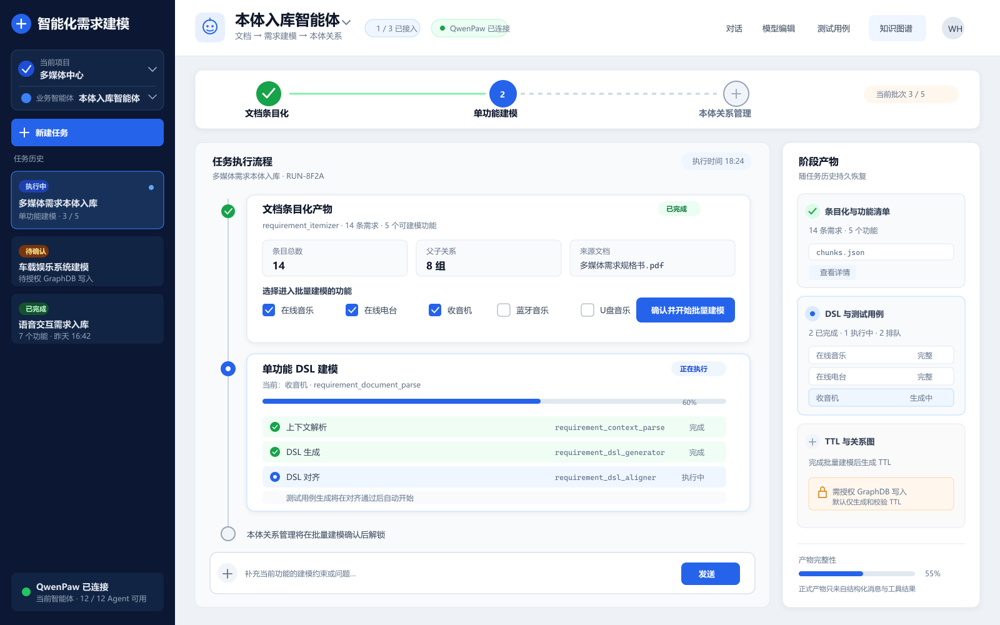
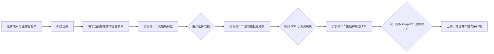
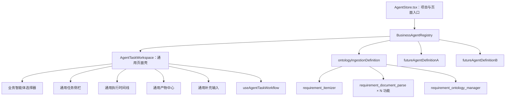

# 多业务智能体任务工作台与本体入库首个工作流计划

本目录描述如何在现有 `/agent/store` 页面中建设可承载多个用户可见业务智能体的统一任务工作台，并把“本体入库智能体”作为第一个接入的工作流。本体工作流继续将使用手册里的三条流水线、3 个入口 Agent 和 9 个执行 Agent 整合为一条完整任务流程。

后续两个业务智能体的名称、步骤和产物尚未确定，因此本计划不虚构它们的业务流程，而是先建立注册式扩展机制。新增业务智能体应通过定义文件和专用扩展接入，不能复制 `AgentStore` 或再造一套侧栏、时间线和会话状态。

本计划只改前端体验与编排，不新增 QwenPaw Agent、不修改后端、不新增业务路由。各业务智能体仍由其入口 Agent 调度内部执行 Agent，前端负责业务智能体选择、统一任务壳、阶段门禁、任务聚合、产物归档和恢复。

## 页面设计图

[查看 PNG 设计稿](./assets/ontology-ingestion-agent-page.png) · [查看可编辑 SVG 原图](./assets/ontology-ingestion-agent-page.svg)

详细页面说明见 [00-page-design.md](./00-page-design.md)。

## 文档索引

| 顺序 | 文档 | 内容 |
| --- | --- | --- |
| 0 | [00-page-design.md](./00-page-design.md) | 页面结构、关键状态、交互规则和视觉规范 |
| 1 | [01-state-and-history.md](./01-state-and-history.md) | 统一任务模型、会话关联、历史聚合和恢复 |
| 2 | [02-workflow-ui.md](./02-workflow-ui.md) | 引导表单、阶段步骤条、执行时间线和产物中心 |
| 3 | [03-structured-artifacts.md](./03-structured-artifacts.md) | 结构化协议、工具消息、阶段门禁和 GraphDB 授权 |
| 4 | [04-resilience-and-acceptance.md](./04-resilience-and-acceptance.md) | 异常恢复、回归范围、分阶段验收和交付条件 |
| API | [05-qwenpaw-api-capability-matrix.md](./05-qwenpaw-api-capability-matrix.md) | 两份 QwenPaw API 文档核对、能力映射和不能假设的边界 |
| 扩展 | [06-multi-agent-extensibility.md](./06-multi-agent-extensibility.md) | 三个业务智能体的注册机制、通用壳与本体专用扩展边界 |
| Skill | [07-skill-artifact-integration.md](./07-skill-artifact-integration.md) | 现有查询 Skill、消息 Renderer、本地产物回传、重新查询和协议缺口 |

## 术语边界

- **业务智能体**：用户在页面中选择的任务能力。当前已知“本体入库智能体”，后续还会增加两个，共三个。
- **QwenPaw 执行 Agent**：业务智能体背后的运行单元。本体入库智能体当前包含 3 个入口 Agent 和 9 个内部执行 Agent。
- **工作流定义**：描述业务智能体名称、入口 Agent、步骤、表单、产物分组和扩展组件的前端注册对象。

用户可以切换三个业务智能体，但不会直接选择内部 QwenPaw 执行 Agent。

## 本体入库工作流的三条流水线与 12 个执行 Agent

| 流水线 | 入口 Agent | 内部执行 Agent | 手册任务 | 标准产物 | 阶段门禁 |
| --- | --- | --- | --- | --- | --- |
| 文档条目化 | `requirement_itemizer` | `requirement_index_parser`、`requirement_document_extractor` | 任务 1–2 | 条目、功能清单、父子功能关系、证据位置 | 用户选择一个或多个功能后才能继续 |
| 单功能 DSL 建模 | `requirement_document_parse` | `requirement_context_parse`、`requirement_dsl_generator`、`requirement_dsl_aligner`、`requirement_testcase_generator` | 任务 3–6 | 上下文、五维 DSL、对齐结果、测试用例 | 所选功能全部成功，或用户处理完失败项后才能继续 |
| 本体关系管理 | `requirement_ontology_manager` | `requirement_ontology_parser`、`requirement_ontology_uploader`、`requirement_ontology_inferencer` | 任务 7–10 | TTL、校验结果、GraphDB 写入结果、推理关系 | 必须显式确认 GraphDB 地址、仓库和追加写入授权 |

## 目标用户流程

当用户选择“本体入库智能体”时，页面呈现上述三阶段流程，不再让用户选择其 12 个执行 Agent。未来两个业务智能体使用同一页面壳，但可拥有不同步骤、表单和产物。执行时间线仍显示当前由哪个 QwenPaw 执行 Agent 工作，便于排障和审计。

## 前端目标架构

## QwenPaw API 核对结论

计划已对照以下两份项目内文档重新核验：

- [QwenPaw RESTful API 调用指南](../../QwenPaw%20RESTful%20API%20调用指南.md)
- [QwenPaw Agent Session RESTful API 调用文档](../../QwenPaw%20Agent%20Session%20RESTful%20API%20调用文档.md)

可直接复用的能力包括：查询 Agent、按 Agent 查询已登记 ChatSpec、按精确 `user_id / channel` 筛选、按 `ChatSpec.id` 读取历史、用 `session_id / user_id / channel` 延续会话、文件两步上传，以及 SSE 文本、工具和终态事件。

计划不能假设 QwenPaw 提供以下能力：独立创建/重命名/删除/置顶 Session、按 `user_id` 前缀筛选、ChatSpec 分页排序、批量读取历史、扫描未登记的 `sessions/` 文件。具体映射见 [05-qwenpaw-api-capability-matrix.md](./05-qwenpaw-api-capability-matrix.md)。

## 已锁定的产品决定

- 保留现有 `/agent/store` 路由、项目选择、新建项目、删除项目和跳转项目工作区的能力。
- 同一路由内增加业务智能体选择器；可用 `?agent={businessAgentId}` 恢复选择，不新增业务路由。
- 侧栏只展示当前项目、当前业务智能体的任务；切换业务智能体不会混入其他智能体的历史。
- 旧的独立 QwenPaw Agent 会话不删除，只在新界面隐藏。
- “新建任务”先创建本地 draft；首次 `POST /api/console/chat` 才会促成远端 ChatSpec 登记，不调用不存在的 Session 创建接口。
- 通用壳根据工作流定义渲染新任务表单；本体入库定义要求源文档、同版本 MinerU Markdown、输出目录、项目名称和目标。
- 首条请求使用非空 `TextContent` 表达操作意图，用 `DataContent` 携带结构化 Run 上下文，再追加已上传的 `FileContent`。
- 流水线二支持多选功能，但首版按队列逐个执行，避免多个 SSE 流互相覆盖；UI 仍呈现批处理进度。
- 流水线之间采用人工确认，不依据普通聊天文本自动跳步。
- 阶段状态只由可校验的 fenced message / tool message 决定。
- 本地产物由对应入口 Agent 会话中的查询 Skill 读取，再通过现有
  fenced/tool Renderer 返回；本地路径不作为浏览器可打开的 artifact URI。
- 流水线三先生成和校验 TTL；GraphDB 上传必须经过单独授权。
- 标准场景下，每条流水线结束后的产物都能从固定“阶段产物”区域重新查看。
- 不把密码、令牌等 GraphDB 凭据持久化到任务历史或浏览器存储。
- 通用组件不得硬编码“本体”“三阶段”“GraphDB”“12 Agent”或本体 artifact kind；这些内容由本体工作流定义和扩展组件提供。

## 分阶段实施

| 阶段 | 主要交付 | 人工检查点 |
| --- | --- | --- |
| 第零阶段 | 当前 QwenPaw 与查询 Skill 契约冒烟：版本、Agent、上传、SSE、ChatSpec、三个现有 Skill 及历史详情 | 实际响应与 API/Skill 契约一致；不一致时先修订契约 |
| 第一阶段 | 业务智能体注册表、通用 Run 状态、按定义聚合历史、本体 12 Agent 健康检查 | 能切换测试定义，任务历史不串线 |
| 第二阶段 | 通用任务页面壳、定义驱动表单/步骤/产物区域、本体工作流 UI | 本体流程完整，通用壳无本体硬编码 |
| 第三阶段 | 通用工作流协议、现有消息面板复用、本体专用产物与 GraphDB 门禁 | 通用协议可服务不同步骤，本体产物可回看 |
| 第四阶段 | 智能体切换恢复、部分失败、项目切换、扩展性契约测试和人工回归 | 用两个非生产 fixture 证明可挂载另外两个智能体 |

从第零阶段开始，每个阶段完成后停止继续实施，等待人工评审通过再进入下一阶段。

## 完成定义

1. 页面支持三个用户可见业务智能体的选择位置，本体入库智能体作为首个正式定义。
2. 用户无需了解每个业务智能体背后的入口/执行 Agent 选择方式。
3. 当前业务智能体依赖的 QwenPaw Agent 缺失、禁用或离线时，任务开始前给出明确阻断原因；不会无关地阻断其他业务智能体。
4. 一个本体入库任务可关联流水线一的 1 个会话、流水线二的 N 个功能会话、流水线三的 1 个会话。
5. 刷新页面或重新选择项目/业务智能体后，能从 QwenPaw ChatSpec 和消息历史恢复步骤、Job 进度与产物。
6. 每个工作流步骤都有明确的运行中、待确认、已完成和失败状态。
7. 本体工作流所选功能逐项显示上下文、DSL、对齐和测试用例结果；单项失败可重试，不重跑已成功功能。
8. 未授权时不得从前端触发 GraphDB 上传步骤；未授权状态不是失败。
9. 条目化、DSL / 测试用例、TTL / 关系结果均可在产物中心查看。
10. 原有项目管理和 `/workspace/:projectId?view=...` 导航行为不回归。
11. 不修改 QwenPaw 服务端配置、不新增后端接口、不清理用户已有会话。
12. 历史索引只使用已登记 ChatSpec；空历史、未登记 Session 和 ChatSpec 的 `idle/running` 不会被误判为工作流完成。
13. 后续新增两个业务智能体时，不修改 `AgentStore.tsx`、通用任务壳或通用 reducer，只新增定义及必要的专用适配器。
