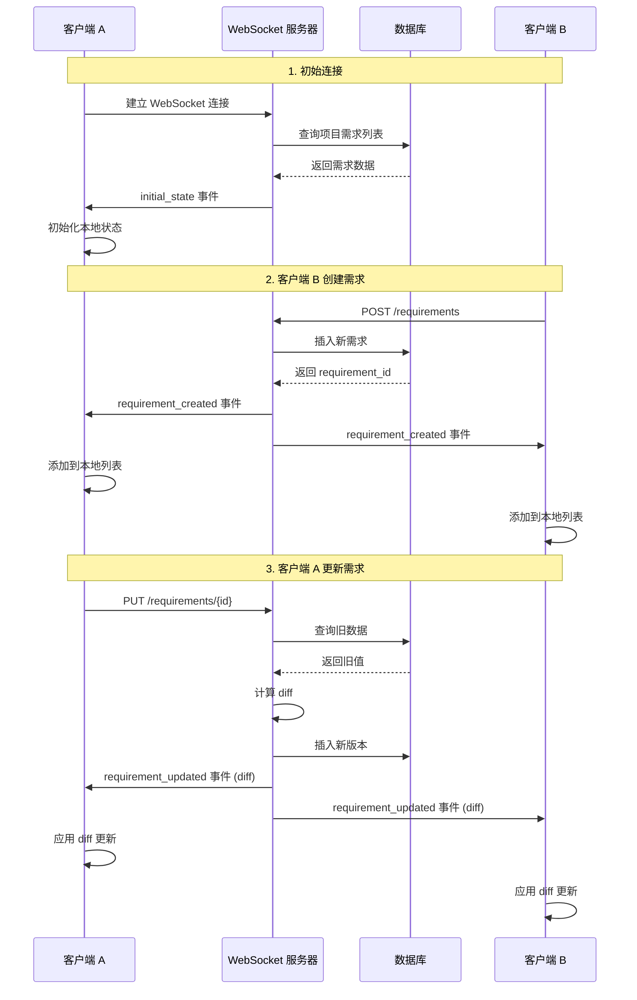

# WebSocket 客户端同步指南

## 📡 概述

BAIC 系统通过 WebSocket 实现项目级的实时需求同步,采用**服务器推送**模式,客户端无需轮询即可获得最新的需求变更。

---

## 🔌 连接建立

### 端点地址
```
ws://127.0.0.1:8000/ws/projects/{project_id}
```

### 可选参数
- **token** (查询参数): JWT 认证令牌,用于身份识别
  ```
  ws://127.0.0.1:8000/ws/projects/{project_id}?token={JWT_TOKEN}
  ```

### 连接示例

#### JavaScript (浏览器)
```javascript
const projectId = '3fa85f64-5717-4562-b3fc-2c963f66afa6';
const token = 'eyJhbGciOiJIUzI1NiIsInR5cCI6IkpXVCJ9...';

const ws = new WebSocket(
  `ws://127.0.0.1:8000/ws/projects/${projectId}?token=${token}`
);

ws.onopen = () => {
  console.log('✅ WebSocket 连接已建立');
};

ws.onerror = (error) => {
  console.error('❌ WebSocket 错误:', error);
};

ws.onclose = () => {
  console.log('🔌 WebSocket 连接已关闭');
};
```

#### Python
```python
import asyncio
import websockets
import json

async def connect_to_project(project_id: str, token: str):
    uri = f"ws://127.0.0.1:8000/ws/projects/{project_id}?token={token}"
    
    async with websockets.connect(uri) as websocket:
        print("✅ WebSocket 连接已建立")
        
        async for message in websocket:
            data = json.loads(message)
            handle_message(data)

asyncio.run(connect_to_project(project_id, token))
```

---

## 📨 消息类型与处理

服务器会推送 **3 种类型**的消息,客户端需要根据 `event` 字段分别处理:

### 1️⃣ initial_state - 初始状态同步

**触发时机**: WebSocket 连接建立后**立即发送**

**用途**: 将客户端状态与服务器当前状态同步

**消息格式**:
```json
{
  "event": "initial_state",
  "requirements": [
    {
      "id": "req-uuid-1",
      "project_id": "proj-uuid",
      "current_version_id": "version-uuid",
      "previous_version_id": null,
      "nl_text": "自然语言描述",
      "dsl_text": "Graph ...",
      "graph_IBD": {},
      "graph_ESD": null,
      "graph_SC": null,
      "graph_BDD": null,
      "graph_ISD": null,
      "created_by": "user-uuid",
      "created_at": "2026-01-30T12:34:56",
      "updated_at": "2026-01-30T12:34:56"
    }
  ]
}
```

**客户端处理**:
```javascript
case 'initial_state':
  // 完全替换本地需求列表
  state.requirements = msg.requirements;
  console.log(`📦 已同步 ${msg.requirements.length} 条需求`);
  break;
```

---

### 2️⃣ requirement_created - 需求创建事件

**触发时机**: 任意客户端通过 `POST /requirements` 创建新需求时

**特点**: 包含**完整的需求对象**

**消息格式**:
```json
{
  "event": "requirement_created",
  "version_id": "new-version-uuid",
  "requirement": {
    "id": "new-req-uuid",
    "project_id": "proj-uuid",
    "current_version_id": "new-version-uuid",
    "nl_text": "新需求描述",
    "dsl_text": "Graph NewReq ...",
    "graph_SC": { "nodes": [], "transitions": [] },
    "created_at": "2026-02-13T14:30:00"
  }
}
```

**客户端处理**:
```javascript
case 'requirement_created':
  // 插入新需求到列表
  state.requirements.push(msg.requirement);
  console.log(`➕ 新需求已创建: ${msg.requirement.id}`);
  
  // 可选: 通知用户
  showNotification(`新需求: ${msg.requirement.nl_text}`);
  break;
```

---

### 3️⃣ requirement_updated - 需求更新事件

**触发时机**: 任意客户端通过 `PUT /requirements/{id}` 更新需求时

**特点**: 仅包含**变更的字段差异 (diff)**,减少带宽消耗

**消息格式**:
```json
{
  "event": "requirement_updated",
  "version_id": "updated-version-uuid",
  "requirement_id": "req-uuid-1",
  "diff": {
    "nl_text": {
      "before": "旧的自然语言描述",
      "after": "更新后的自然语言描述"
    },
    "graph_IBD": {
      "before": null,
      "after": {
        "nodes": [{"id": "n1", "type": "state"}],
        "edges": []
      }
    }
  }
}
```

**客户端处理**:
```javascript
case 'requirement_updated':
  // 查找对应的需求
  const index = state.requirements.findIndex(
    r => r.id === msg.requirement_id
  );
  
  if (index !== -1) {
    // 应用差异更新
    Object.keys(msg.diff).forEach(field => {
      state.requirements[index][field] = msg.diff[field].after;
    });
    
    console.log(`🔄 需求已更新: ${msg.requirement_id}`);
    console.log(`   变更字段: ${Object.keys(msg.diff).join(', ')}`);
  }
  break;
```

---

## 🎯 完整客户端实现示例

### React + TypeScript 示例

```typescript
import { useEffect, useState, useRef } from 'react';

interface Requirement {
  id: string;
  project_id: string;
  nl_text?: string;
  dsl_text?: string;
  graph_SC?: any;
  // ... 其他字段
}

interface WebSocketMessage {
  event: 'initial_state' | 'requirement_created' | 'requirement_updated';
  requirements?: Requirement[];
  requirement?: Requirement;
  requirement_id?: string;
  version_id?: string;
  diff?: Record<string, { before: any; after: any }>;
}

export function useProjectSync(projectId: string, token: string) {
  const [requirements, setRequirements] = useState<Requirement[]>([]);
  const [isConnected, setIsConnected] = useState(false);
  const wsRef = useRef<WebSocket | null>(null);

  useEffect(() => {
    // 建立 WebSocket 连接
    const ws = new WebSocket(
      `ws://127.0.0.1:8000/ws/projects/${projectId}?token=${token}`
    );
    wsRef.current = ws;

    ws.onopen = () => {
      console.log('✅ WebSocket 已连接');
      setIsConnected(true);
    };

    ws.onmessage = (event) => {
      const msg: WebSocketMessage = JSON.parse(event.data);
      
      switch (msg.event) {
        case 'initial_state':
          // 初始化状态
          setRequirements(msg.requirements || []);
          console.log(`📦 已同步 ${msg.requirements?.length} 条需求`);
          break;

        case 'requirement_created':
          // 添加新需求
          if (msg.requirement) {
            setRequirements(prev => [...prev, msg.requirement!]);
            console.log(`➕ 新需求: ${msg.requirement.id}`);
          }
          break;

        case 'requirement_updated':
          // 应用差异更新
          if (msg.requirement_id && msg.diff) {
            setRequirements(prev => prev.map(req => {
              if (req.id === msg.requirement_id) {
                const updated = { ...req };
                Object.keys(msg.diff!).forEach(field => {
                  updated[field] = msg.diff![field].after;
                });
                return updated;
              }
              return req;
            }));
            console.log(`🔄 需求已更新: ${msg.requirement_id}`);
          }
          break;
      }
    };

    ws.onerror = (error) => {
      console.error('❌ WebSocket 错误:', error);
      setIsConnected(false);
    };

    ws.onclose = () => {
      console.log('🔌 WebSocket 已断开');
      setIsConnected(false);
    };

    // 清理函数
    return () => {
      ws.close();
    };
  }, [projectId, token]);

  return { requirements, isConnected };
}
```

### 使用示例
```typescript
function ProjectWorkspace() {
  const { requirements, isConnected } = useProjectSync(
    '3fa85f64-5717-4562-b3fc-2c963f66afa6',
    localStorage.getItem('jwt_token')!
  );

  return (
    <div>
      <div>连接状态: {isConnected ? '🟢 已连接' : '🔴 未连接'}</div>
      <ul>
        {requirements.map(req => (
          <li key={req.id}>{req.nl_text}</li>
        ))}
      </ul>
    </div>
  );
}
```

---

## 🔄 同步流程图



---

## ⚡ 最佳实践

### 1. 断线重连机制
```javascript
function connectWithRetry(projectId, token, maxRetries = 5) {
  let retryCount = 0;
  
  function connect() {
    const ws = new WebSocket(`ws://.../${projectId}?token=${token}`);
    
    ws.onclose = () => {
      if (retryCount < maxRetries) {
        retryCount++;
        const delay = Math.min(1000 * Math.pow(2, retryCount), 30000);
        console.log(`🔄 ${delay}ms 后重连 (${retryCount}/${maxRetries})`);
        setTimeout(connect, delay);
      } else {
        console.error('❌ 达到最大重连次数');
      }
    };
    
    ws.onopen = () => {
      retryCount = 0; // 重置计数器
    };
    
    return ws;
  }
  
  return connect();
}
```

### 2. 心跳保活
```javascript
ws.onopen = () => {
  // 每 30 秒发送一次心跳
  const heartbeat = setInterval(() => {
    if (ws.readyState === WebSocket.OPEN) {
      ws.send(JSON.stringify({ type: 'ping' }));
    }
  }, 30000);
  
  ws.onclose = () => clearInterval(heartbeat);
};
```

### 3. 乐观更新 + 回滚
```javascript
async function updateRequirement(id, changes) {
  // 1. 乐观更新本地状态
  const oldValue = state.requirements.find(r => r.id === id);
  applyLocalUpdate(id, changes);
  
  try {
    // 2. 发送 API 请求
    const response = await fetch(`/requirements/${id}`, {
      method: 'PUT',
      body: JSON.stringify(changes)
    });
    
    if (!response.ok) throw new Error('更新失败');
    
    // 3. WebSocket 会推送 requirement_updated 事件
    //    此时可以验证本地状态是否一致
  } catch (error) {
    // 4. 失败时回滚
    console.error('更新失败,回滚:', error);
    revertLocalUpdate(id, oldValue);
  }
}
```

### 4. 冲突检测
```javascript
case 'requirement_updated':
  const localReq = state.requirements.find(r => r.id === msg.requirement_id);
  
  // 检查是否存在本地未保存的修改
  if (localReq && localReq._isDirty) {
    // 提示用户存在冲突
    showConflictDialog({
      local: localReq,
      remote: applyDiff(localReq, msg.diff)
    });
  } else {
    // 直接应用远程更新
    applyDiff(msg.requirement_id, msg.diff);
  }
  break;
```

---

## 🛠️ 调试工具

### 使用 websocat 测试
```bash
# 安装 websocat (https://github.com/vi/websocat)
# Windows: scoop install websocat
# macOS: brew install websocat

# 连接并查看消息
websocat "ws://127.0.0.1:8000/ws/projects/3fa85f64-5717-4562-b3fc-2c963f66afa6?token=YOUR_TOKEN"
```

### Chrome DevTools
1. 打开 **Network** 标签
2. 筛选 **WS** (WebSocket)
3. 点击连接查看消息帧
4. 可以看到所有收发的消息

---

## 📊 性能优化建议

### 1. 差异更新 (已实现)
✅ 服务器已实现 `requirement_updated` 仅推送 diff,客户端应充分利用

### 2. 消息批处理
如果短时间内收到大量更新,可以批量处理:
```javascript
let updateQueue = [];
let batchTimer = null;

ws.onmessage = (event) => {
  const msg = JSON.parse(event.data);
  
  if (msg.event === 'requirement_updated') {
    updateQueue.push(msg);
    
    if (!batchTimer) {
      batchTimer = setTimeout(() => {
        processBatch(updateQueue);
        updateQueue = [];
        batchTimer = null;
      }, 100); // 100ms 批处理窗口
    }
  }
};
```

### 3. 虚拟滚动
如果需求列表很长,使用虚拟滚动库 (如 `react-window`) 减少 DOM 渲染

---

## ⚠️ 注意事项

1. **Token 过期处理**: JWT 可能过期,需要在 `onclose` 时检查并刷新 token
2. **多标签页同步**: 如果用户打开多个标签页,建议使用 `BroadcastChannel` 在标签页间同步
3. **离线缓存**: 可以使用 IndexedDB 缓存需求数据,离线时仍可查看
4. **版本冲突**: 当前实现是**最后写入胜出**,如需更复杂的合并策略,考虑引入 CRDT (如 Yjs)

---

## 🚀 总结

客户端同步的核心流程:
1. **连接时**: 接收 `initial_state` 初始化本地状态
2. **新增时**: 接收 `requirement_created` 完整对象,追加到列表
3. **更新时**: 接收 `requirement_updated` 差异对象,应用到对应需求

通过这种**推送 + 差异更新**的机制,实现了高效的多人实时协作。
